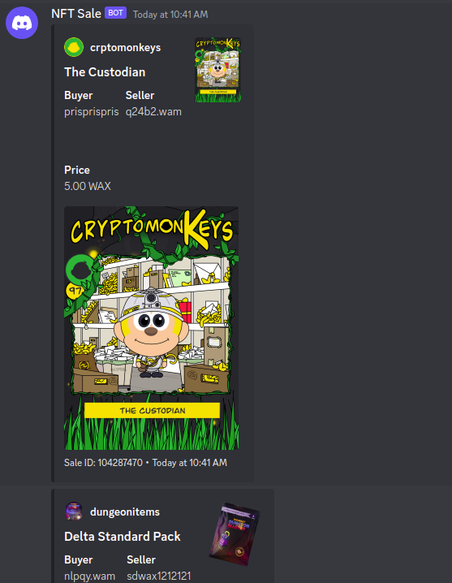

# wax-nftsale-bot

A discord webhook embed notifier for collection nft sales in the `atomicmarket` smartcontract.

## Screenshot



## Development

- Change the default collection name in the [`ATOMICHUB_COLLECTION`](./lib/config.ts)

```ts
// replace with your own collection
export const ATOMICHUB_COLLECTION = "cryptopuppie";
```

- Setup environment variable

```sh
WEBHOOK=your-discord-channel-webhook-url
```

- Install dependencies and run the dev app

```sh
pnpm start
```

## Production

This app uses `pm2`(https://pm2.io/) to manage the app in production

- Deploy the app in your server, install the dependencies and run the following command:

```
pnpm prod:start
```

##

**@tbdsux | 2023**
